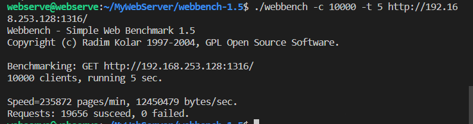

---

title: MyWebserver压力测试
date: 2022-7-26 09:28:30 +0800
tags: [项目,webbench,webserver]
categories: [项目,MyWebServer]
typora-root-url: ..

---

## webbench压力测试

==webbench简介==

webbench是Linux下使用的一个轻量级（适用于中小型网站）的服务器压力测试工具，通过webbench可以得到以下数据：

* `Speed`传输速度，每分钟请求数及每秒请求字节数
* `Requests`请求数量，统计成功和失败次数

==测试原理==

利用fork建立多个子进程，每个子进程在测试时间内不断发送请求报文，父子进程通过管道进行通信，子进程通过管道写端向父进程传递在若干次请求访问完毕后记录到的总信息，父进程通过管道读端读取子进程发来的相关信息，子进程在测试时间完成后结束，父进程在所有子进程退出后统计并显示最后的测试结果，然后退出。webbench最多可以模拟3万多个并发连接数。

==使用webbench==

* 首先下载webbench-1.5并安装；

* 进入webbench目录下，使用`make`命令生成`webbench`可执行文件；

* 在进行压测先要先打开网页服务器，然后在终端上执行以下命令：

```bash
# ./webbench -c 并发数量 -t 测试时间 URL
./webbench -c 10000 -t 5 http://192.168.253.128:1316/
```



测试环境：Ubuntu:18.2 cpu:i5-10400 内存:8G

QPS：10000+